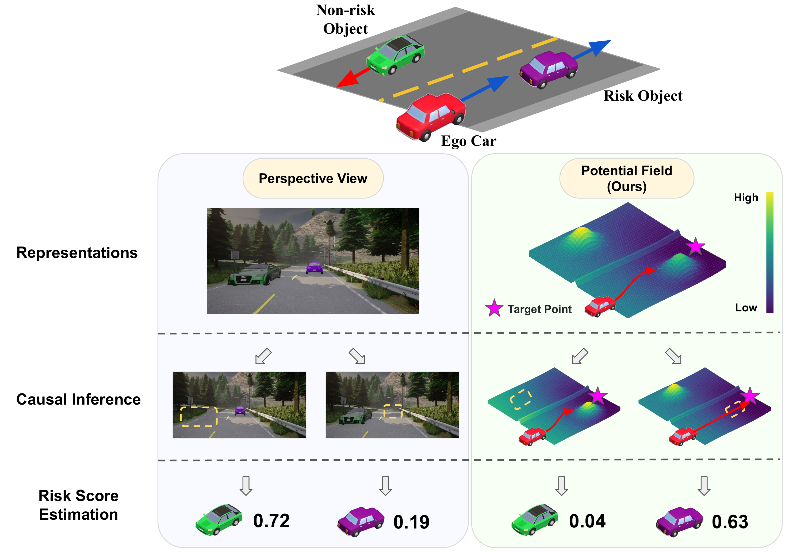

# PF-BCP

  [**Project Page**](https://hcis-lab.github.io/PF-BCP/) 
| [**Video Overview**](https://www.youtube.com/watch?v=7Een9DPa9ms)
| [**Paper Preprint**](https://arxiv.org/abs/2409.15846)


[](https://arxiv.org/abs/2409.15846)
[](./LICENSE)


This repository contains the official code for training and evaluating the methods as described in:

<!-- ## 📋 Overview



**Authors:**
[**Pang-Yuan Pao**](https://github.com/WaywayPao/),
[**Shu-Wei Lu**](https://www.linkedin.com/in/shu-wei-lu/),
**Ze-Yan Lu**,
[**Yi-Ting Chen**](https://sites.google.com/site/yitingchen0524)

**Affiliation: [National Yang Ming Chiao Tung University](https://www.nycu.edu.tw/nycu/en/index)** -->


> **Potential Field as Scene Affordance for Behavior Change-Based Visual Risk Object Identification** <br/>
> [Pang-Yuan Pao](https://github.com/WaywayPao/),
[Shu-Wei Lu](https://www.linkedin.com/in/shu-wei-lu/),
Ze-Yan Lu and
[Yi-Ting Chen](https://sites.google.com/site/yitingchen0524) <br/>
> [National Yang Ming Chiao Tung University](https://www.nycu.edu.tw/nycu/en/index)


<p align="center">
    
    
    <br/>
    <sub><em> Visual Risk Object Identification by different methods. <br/>
    All detected risk objects are shown with green bounding boxes, while ground truth risks are masked in red. <br/>
    BS, PF refer to Bird's-Eye-View Segmentation and Potential Field respectively.
    </em></sub>
</p>


# ⚙️ Getting Started

### 📦 Datasets Downloads
* Download `RiskBench_Dataset` [here](https://nycu1-my.sharepoint.com/:f:/g/personal/ychen_m365_nycu_edu_tw/EviA5ovlh6hPo_ZXEPQjxAQB2R3vNubk3HM1u4ib1VdPFA?e=WHEWdm).

* Download `metadata.zip` [here](./ROI_demo/metatdata.zip).


### 📥 Dependency Installation
1. Create and activate a new Conda environment:
    ```bash
    conda create -n YOUR_ENV python=3.7
    conda activate YOUR_ENV
    ```

2. Run the following command to install all required packages from ``requirements.txt``:
    ```bash
    pip install -r requirements.txt
    ```

# 🚀 Usage
### Comming Soon


# 📊 Fine-grained Scenario-based Analysis

We perform offline risk identification evaluation and fine-grained scenario-based analysis by taking input as preserved risk identification prediction. 


To perform the evaluation, please follow the instructions provided [here](./ROI_demo).


# 📄 Citation
If you find PF-BCP helpful in your work, please consider citing the following:
```
@article{pao2024PFBCP,
    title   = {{Potential Field as Scene Affordance for Behavior Change-Based Visual Risk Object Identification}},
    author  = {Pang-Yuan Pao and Shu-Wei Lu and Ze-Yan Lu and Yi-Ting Chen},
    year    = {2024},
    eprint  = {2409.15846},
    archivePrefix = {arXiv}
}
```

<!-- # 📜 License

This project is licensed under the [GPL-3.0 LICENSE](./LICENSE). -->


